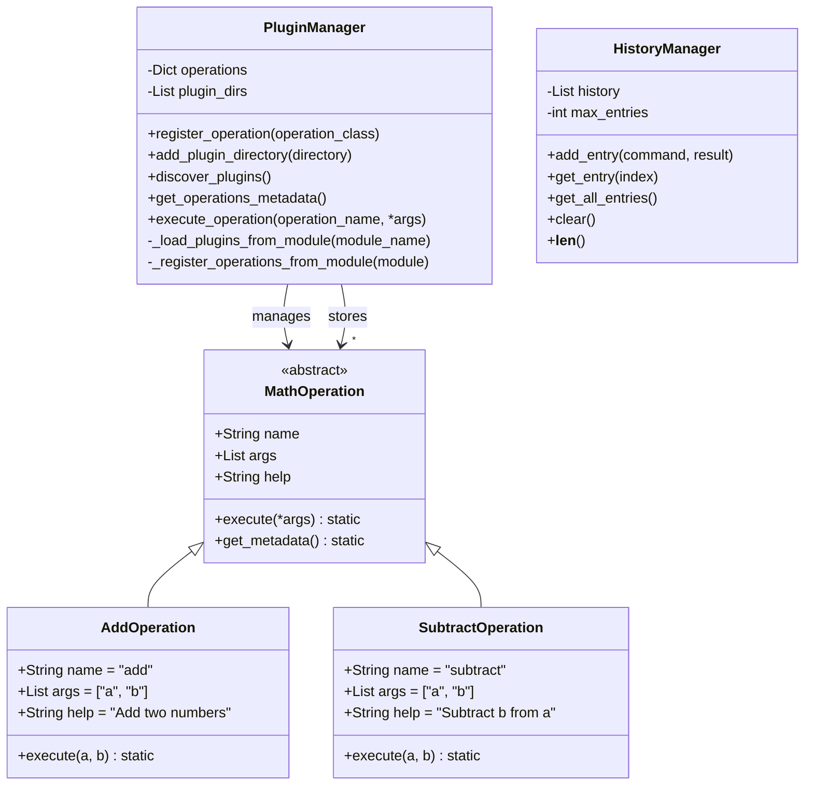

## 1. Class Diagram (UML)

This diagram shows the main classes and their relationships.

```mermaid
classDiagram
    class MathOperation {
        <<abstract>>
        +String name
        +List args
        +String help
        +execute(*args) static
        +get_metadata() static
    }

    class PluginManager {
        -Dict operations
        -List plugin_dirs
        +register_operation(operation_class)
        +add_plugin_directory(directory)
        +discover_plugins()
        +get_operations_metadata()
        +execute_operation(operation_name, *args)
        -_load_plugins_from_module(module_name)
        -_register_operations_from_module(module)
    }

    class HistoryManager {
        -List history
        -int max_entries
        +add_entry(command, result)
        +get_entry(index)
        +get_all_entries()
        +clear()
        +__len__()
    }

    class AddOperation {
        +String name = "add"
        +List args = ["a", "b"]
        +String help = "Add two numbers"
        +execute(a, b) static
    }

    class SubtractOperation {
        +String name = "subtract"
        +List args = ["a", "b"]
        +String help = "Subtract b from a"
        +execute(a, b) static
    }

    MathOperation <|-- AddOperation
    MathOperation <|-- SubtractOperation
    PluginManager --> MathOperation : manages
    PluginManager --> "*" MathOperation : stores
```
