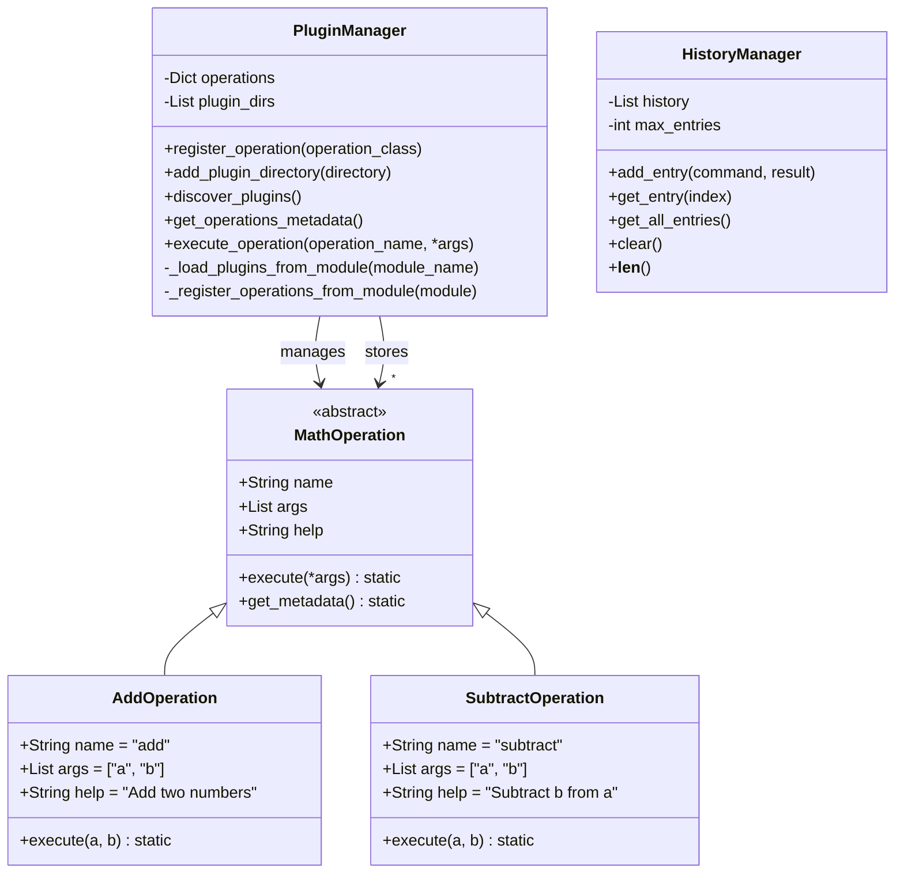

## 1. Class Diagram (UML)

This UML class diagram illustrates the core class hierarchy and relationships within the Math CLI application.

### Class Descriptions

#### MathOperation (Abstract Base Class)
This abstract base class defines the interface for all mathematical operations in the system:
- **name**: A string identifier for the operation (e.g., "add", "subtract")
- **args**: A list of argument names required by the operation
- **help**: A descriptive string explaining what the operation does
- **execute(*args)**: A static method that implements the mathematical operation logic
- **get_metadata()**: A static method that returns the operation's metadata (name, args, help)

#### PluginManager
Manages the discovery, loading, and execution of mathematical operations:
- **operations**: A dictionary mapping operation names to their implementing classes
- **plugin_dirs**: A list of directories to search for plugins
- **register_operation(operation_class)**: Registers a MathOperation subclass with the manager
- **add_plugin_directory(directory)**: Adds a directory to the search path for plugins
- **discover_plugins()**: Recursively discovers and loads plugins from all registered directories
- **get_operations_metadata()**: Returns metadata for all registered operations
- **execute_operation(operation_name, *args)**: Executes the specified operation with the given arguments
- **_load_plugins_from_module(module_name)**: Loads plugins from a specific module (private method)
- **_register_operations_from_module(module)**: Registers all MathOperation subclasses from a module (private method)

#### HistoryManager
Maintains a history of executed commands and their results:
- **history**: A list of command history entries
- **max_entries**: The maximum number of entries to store in the history
- **add_entry(command, result)**: Adds a new command and its result to the history
- **get_entry(index)**: Retrieves a specific history entry by index
- **get_all_entries()**: Returns all history entries
- **clear()**: Clears all history entries
- **__len__()**: Returns the number of entries in the history

#### AddOperation (Concrete Implementation)
Example implementation of the MathOperation interface for addition:
- **name = "add"**: Identifies this operation as "add"
- **args = ["a", "b"]**: Specifies that this operation takes two arguments
- **help = "Add two numbers"**: Provides a description of the operation
- **execute(a, b)**: Implements the addition operation (returns a + b)

#### SubtractOperation (Concrete Implementation)
Example implementation for subtraction, similar to AddOperation but for subtraction.
