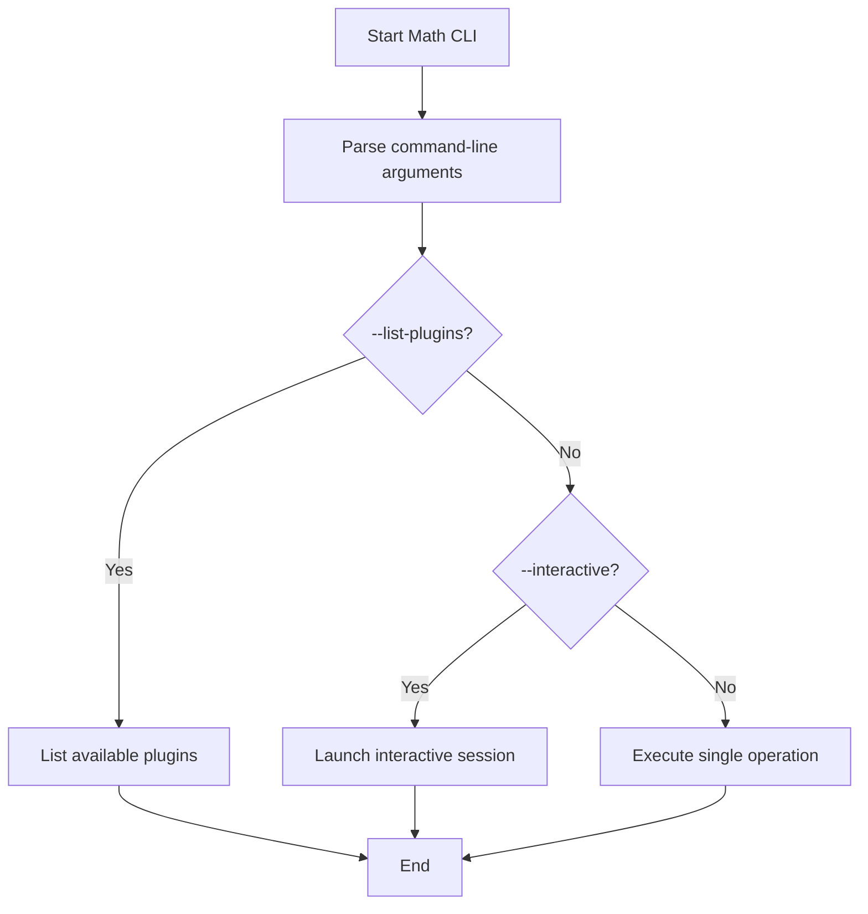

## 8. CLI Startup Flowchart

This flowchart shows how the application processes command-line arguments and determines how to run.

### Startup Steps

1. **Start Math CLI** – The application begins execution.
2. **Parse command-line arguments** – The CLI reads options and parameters.
3. **List plugins** – If `--list-plugins` is supplied, available operations are shown and the program exits.
4. **Interactive mode** – If `--interactive` is provided, the interactive REPL starts.
5. **Execute single operation** – Otherwise the specified operation is run once and the result is printed.
6. **End** – The program terminates after completing the selected action.
