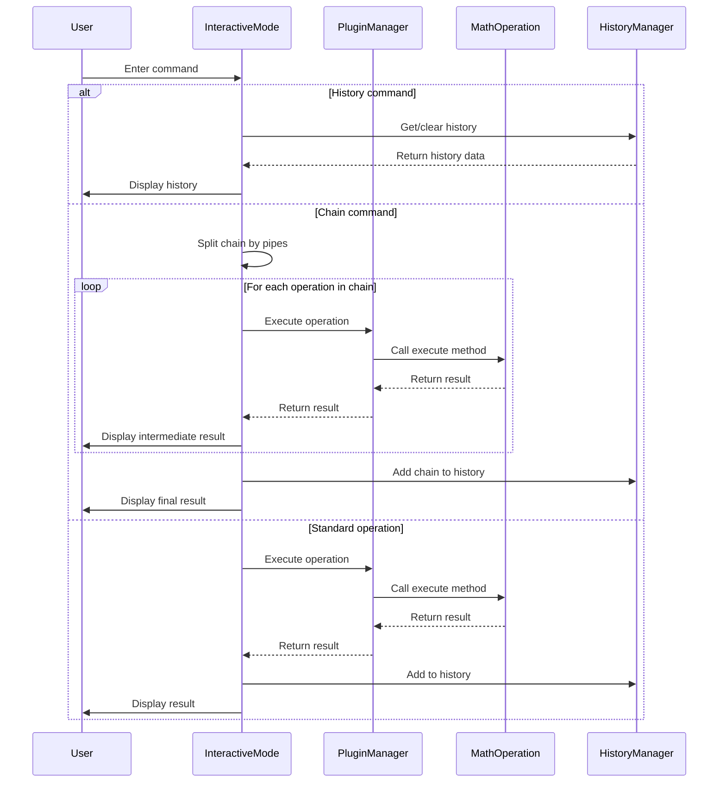

## 4. Command Execution Sequence Diagram

This diagram shows how a command is processed in the interactive mode.

```mermaid
sequenceDiagram
    participant User
    participant InteractiveMode
    participant PluginManager
    participant MathOperation
    participant HistoryManager

    User->>InteractiveMode: Enter command

    alt History command
        InteractiveMode->>HistoryManager: Get/clear history
        HistoryManager-->>InteractiveMode: Return history data
        InteractiveMode->>User: Display history
    else Chain command
        InteractiveMode->>InteractiveMode: Split chain by pipes
        loop For each operation in chain
            InteractiveMode->>PluginManager: Execute operation
            PluginManager->>MathOperation: Call execute method
            MathOperation-->>PluginManager: Return result
            PluginManager-->>InteractiveMode: Return result
            InteractiveMode->>User: Display intermediate result
        end
        InteractiveMode->>HistoryManager: Add chain to history
        InteractiveMode->>User: Display final result
    else Standard operation
        InteractiveMode->>PluginManager: Execute operation
        PluginManager->>MathOperation: Call execute method
        MathOperation-->>PluginManager: Return result
        PluginManager-->>InteractiveMode: Return result
        InteractiveMode->>HistoryManager: Add to history
        InteractiveMode->>User: Display result
    end
```
