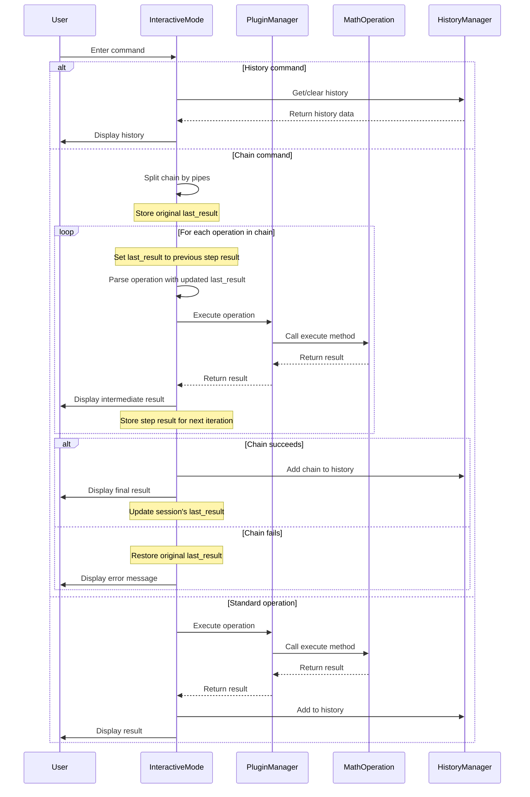

## 4. Command Execution Sequence Diagram

This sequence diagram visualizes the flow of a command through the system, from user input to result output, illustrating the interactions between the major components.

### Command Execution Process

#### Initial Command Entry
1. **User enters command**: The user types a command in the interactive mode.

#### History Command Flow
If the user enters a history-related command:
1. **InteractiveMode calls HistoryManager**: The interactive mode calls the appropriate method on the HistoryManager.
2. **HistoryManager returns data**: The requested history information is returned.
3. **InteractiveMode displays history**: The history information is formatted and displayed to the user.

#### Chain Command Flow
If the user enters a chain command (`chain ...`):
1. **InteractiveMode splits the chain**: The command is split into individual operations at pipe (`|`) symbols.
2. **Store original last_result**: The current last_result is stored temporarily to enable proper error handling.
3. **For each operation in the chain**:
   - **Update last_result with previous step result**: The last_result is updated to use the result from the previous step.
   - **Parse operation with updated last_result**: The operation is parsed with $ and ans being replaced with the current chain result.
   - **InteractiveMode calls PluginManager**: The operation is executed through the PluginManager.
   - **PluginManager calls MathOperation**: The appropriate MathOperation's execute method is called.
   - **MathOperation returns result**: The mathematical operation is performed and the result returned.
   - **PluginManager returns result to InteractiveMode**: The result is passed back to the interactive mode.
   - **InteractiveMode displays intermediate result**: Each step's result is shown to the user.
   - **Store step result for next iteration**: The result is stored for the next step to use.
4. **If chain succeeds**:
   - **InteractiveMode adds chain to history**: The entire chain command and final result are added to history.
   - **InteractiveMode displays final result**: The final result of the chain is shown to the user.
   - **Update session's last_result**: The session's last_result is updated with the chain's final result.
5. **If chain fails**:
   - **Restore original last_result**: The last_result is restored to its value before the chain started.
   - **Display error message**: An appropriate error message is shown to the user.

#### Standard Operation Flow
If the user enters a standard operation:
1. **InteractiveMode calls PluginManager**: The operation is executed through the PluginManager.
2. **PluginManager calls MathOperation**: The appropriate MathOperation's execute method is called.
3. **MathOperation returns result**: The mathematical operation is performed and the result returned.
4. **PluginManager returns result to InteractiveMode**: The result is passed back to the interactive mode.
5. **InteractiveMode adds to history**: The command and result are added to the history.
6. **InteractiveMode displays result**: The result is shown to the user.
