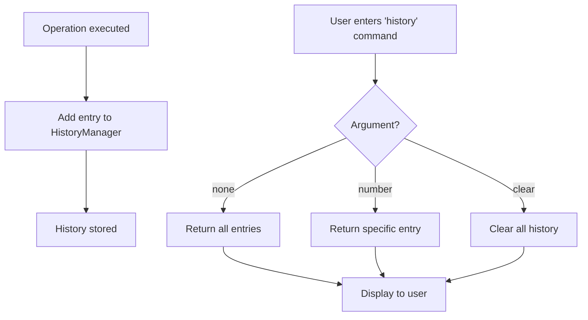

## 9. History Management Flow

This diagram illustrates how the interactive mode records and retrieves command history.

### History Actions

1. **Operation executed** – After each successful command, the result is recorded.
2. **Add entry** – The command and result are stored in the HistoryManager.
3. **History command** – When the user types `history`, the system checks for additional arguments.
4. **Return all entries** – Without arguments, the full history is displayed.
5. **Return specific entry** – With a number, a particular entry is shown.
6. **Clear all history** – The `history clear` command removes all stored entries.
