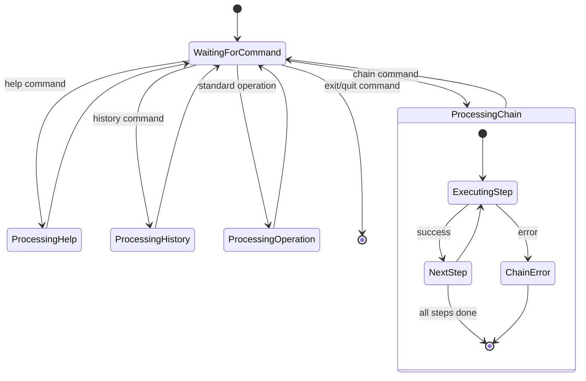

## 5. Interactive Mode State Diagram

This state diagram illustrates the different states and transitions within the interactive mode, showing how the application responds to different types of user input.

### Interactive Mode States

#### WaitingForCommand
The default state where the application is waiting for user input. From this state, the application can transition to:
- **ProcessingHelp**: When the user enters the "help" command
- **ProcessingHistory**: When the user enters a history-related command
- **ProcessingChain**: When the user enters a chain command
- **ProcessingOperation**: When the user enters a standard operation
- **Exit**: When the user enters "exit" or "quit"

#### ProcessingHelp
Handles the display of help information, then returns to the WaitingForCommand state.

#### ProcessingHistory
Processes history commands (view, get specific entry, clear), then returns to the WaitingForCommand state.

#### ProcessingChain
A complex state that handles chained calculations, with its own internal states:
- **ExecutingStep**: Executes a single step in the chain
- **NextStep**: Prepares for the next operation in the chain
- **ChainError**: Handles errors that occur during chain execution
- The chain processing ends when all steps are complete or an error occurs

#### ProcessingOperation
Executes a single mathematical operation, then returns to the WaitingForCommand state.
