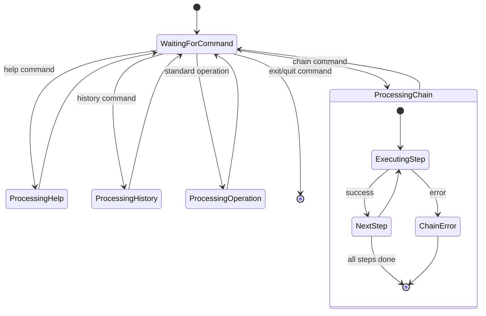

## 5. Interactive Mode State Diagram

This diagram shows the state transitions in interactive mode.

```mermaid
stateDiagram-v2
    [*] --> WaitingForCommand

    WaitingForCommand --> ProcessingHelp: help command
    ProcessingHelp --> WaitingForCommand

    WaitingForCommand --> ProcessingHistory: history command
    ProcessingHistory --> WaitingForCommand

    WaitingForCommand --> ProcessingChain: chain command
    ProcessingChain --> WaitingForCommand

    WaitingForCommand --> ProcessingOperation: standard operation
    ProcessingOperation --> WaitingForCommand

    WaitingForCommand --> [*]: exit/quit command

    state ProcessingChain {
        [*] --> ExecutingStep
        ExecutingStep --> NextStep: success
        NextStep --> ExecutingStep
        ExecutingStep --> ChainError: error
        NextStep --> [*]: all steps done
        ChainError --> [*]
    }
```
