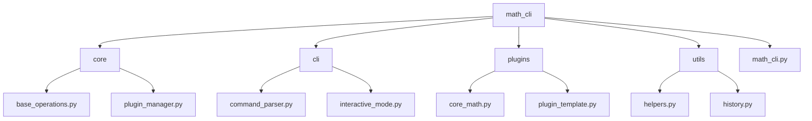

## 2. Package Structure Diagram

This diagram provides an overview of the Math CLI's package organization, showing how the code is modularly separated into distinct areas of responsibility.

### Package Descriptions

#### math_cli (Root Package)
The main package containing the entry point for the application and all subpackages.
- **math_cli.py**: The main entry point for the CLI application that orchestrates all components.

#### core
Contains the fundamental classes that define the system's architecture:
- **base_operations.py**: Defines the MathOperation abstract base class
- **plugin_manager.py**: Implements the PluginManager for discovering and loading plugins

#### cli
Handles the command-line interface and user interaction:
- **command_parser.py**: Parses and validates user commands from the command line
- **interactive_mode.py**: Provides the interactive shell for executing commands sequentially

#### plugins
Contains the actual mathematical operations:
- **core_math.py**: Implements the basic mathematical operations (add, subtract, etc.)
- **plugin_template.py**: Provides a template for users to create their own plugins

#### utils
Contains utility classes and helper functions:
- **helpers.py**: General utility functions used throughout the application
- **history.py**: Implements the HistoryManager for tracking calculation history
