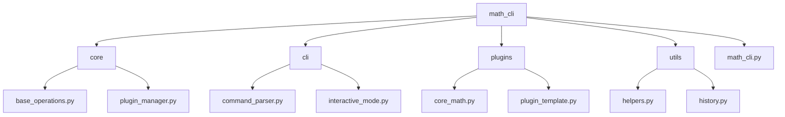

## 2. Package Structure Diagram

This diagram shows the organization of the codebase into packages and modules.

```mermaid
graph TD
    A[math_cli] --> B[core]
    A --> C[cli]
    A --> D[plugins]
    A --> E[utils]

    B --> B1[base_operations.py]
    B --> B2[plugin_manager.py]

    C --> C1[command_parser.py]
    C --> C2[interactive_mode.py]

    D --> D1[core_math.py]
    D --> D2[plugin_template.py]

    E --> E1[helpers.py]
    E --> E2[history.py]

    A --> A1[math_cli.py]
```
