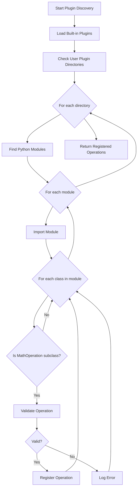

## 7. Plugin Loading Process Diagram

This diagram details how plugins are loaded.

```mermaid
flowchart TD
    A[Start Plugin Discovery] --> B[Load Built-in Plugins]
    B --> C[Check User Plugin Directories]

    C --> D{For each directory}
    D --> E[Find Python Modules]
    E --> F{For each module}
    F --> G[Import Module]
    G --> H{For each class in module}

    H --> I{Is MathOperation subclass?}
    I -- Yes --> J[Validate Operation]
    I -- No --> H

    J --> K{Valid?}
    K -- Yes --> L[Register Operation]
    K -- No --> M[Log Error]

    L --> H
    M --> H

    H --> F
    F --> D

    D --> N[Return Registered Operations]
```
