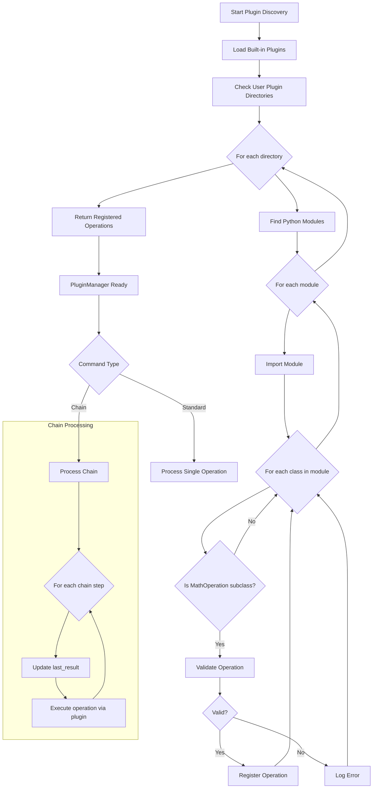

## 7. Plugin Loading Process Diagram

This detailed flowchart illustrates the exact process of discovering, loading, and registering plugins, showing how the application dynamically extends its functionality.

### Plugin Loading Process Steps

1. **Start Plugin Discovery**: The plugin discovery process begins when the application starts or when a user adds a new plugin directory.
2. **Load Built-in Plugins**: First, the system loads the standard plugins included with the application.
3. **Check User Plugin Directories**: The system identifies any additional directories specified by the user.
4. **For each directory**: Each plugin directory is processed in turn.
5. **Find Python Modules**: All Python (`.py`) files in the directory are identified.
6. **For each module**: Each Python module is processed.
7. **Import Module**: The module is dynamically imported into the application.
8. **For each class in module**: The system inspects all classes defined in the module.
9. **Is MathOperation subclass?**: The system checks if the class inherits from the MathOperation base class.
10. **Validate Operation**: If it is a subclass, the operation is validated (checks for required attributes, etc.).
11. **Valid?**: A decision point based on validation results:
    - If valid, proceed to registration
    - If invalid, log the error
12. **Register Operation**: Add the valid operation to the PluginManager's registry.
13. **Log Error**: Record information about invalid operations for debugging.
14. **Return Registered Operations**: After processing all directories and modules, return the complete set of registered operations.

The detailed plugin loading process enables the Math CLI to be highly extensible while maintaining stability through validation.

### Updated Plugin Loading and Usage Process

The updated diagram now includes a new section that illustrates how the registered plugins are used in different command types, with particular emphasis on the chain processing workflow:

1. **PluginManager Ready**: After all plugins are loaded and registered, the PluginManager is ready to execute operations
2. **Command Type**: The system determines whether to process a chain command or a standard operation
3. **Chain Processing**: For chain commands, a special processing loop is used:
   - **For each chain step**: Each operation in the chain is processed sequentially
   - **Update last_result**: Before each step, the last_result is updated with the previous step's result
   - **Execute operation via plugin**: The operation is executed using the appropriate plugin

This updated diagram better reflects how the plugin system integrates with the chain processing functionality, particularly with the new behavior of updating the last_result between chain steps.
