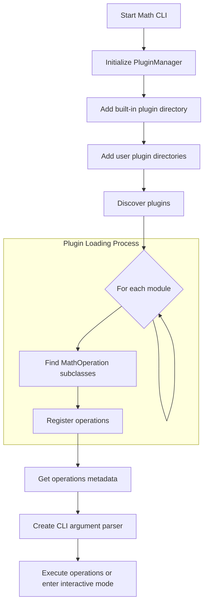

## 3. Plugin System Flowchart

This diagram shows how the plugin system works.

```mermaid
flowchart TD
    A[Start Math CLI] --> B[Initialize PluginManager]
    B --> C[Add built-in plugin directory]
    C --> D[Add user plugin directories]
    D --> E[Discover plugins]

    E --> F{For each module}
    F --> G[Find MathOperation subclasses]
    G --> H[Register operations]
    F --> F

    H --> I[Get operations metadata]
    I --> J[Create CLI argument parser]
    J --> K[Execute operations or enter interactive mode]

    subgraph Plugin Loading Process
    F
    G
    H
    end
```
