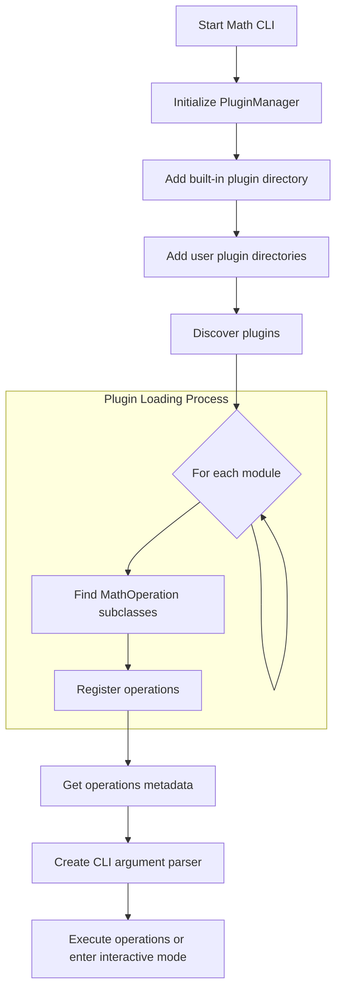

## 3. Plugin System Flowchart

This flowchart details how the plugin system discovers, loads, and registers mathematical operations from both built-in and user-provided sources.

### Plugin System Description

1. **Start Math CLI**: The application begins execution at the main entry point.
2. **Initialize PluginManager**: A new PluginManager instance is created to handle plugin discovery and loading.
3. **Add built-in plugin directory**: The directory containing standard operations is registered.
4. **Add user plugin directories**: Any user-specified plugin directories (via `--plugin-dir`) are registered.
5. **Discover plugins**: The PluginManager recursively searches all registered directories for plugins.
6. **For each module**: Each Python module found in the plugin directories is processed.
7. **Find MathOperation subclasses**: The module is inspected to find all classes that inherit from MathOperation.
8. **Register operations**: Valid operation classes are registered with the PluginManager.
9. **Get operations metadata**: After all plugins are loaded, metadata is collected from all registered operations.
10. **Create CLI argument parser**: The CLI parser is built based on the collected operation metadata.
11. **Execute operations or enter interactive mode**: The application either executes a single operation or enters interactive mode.
