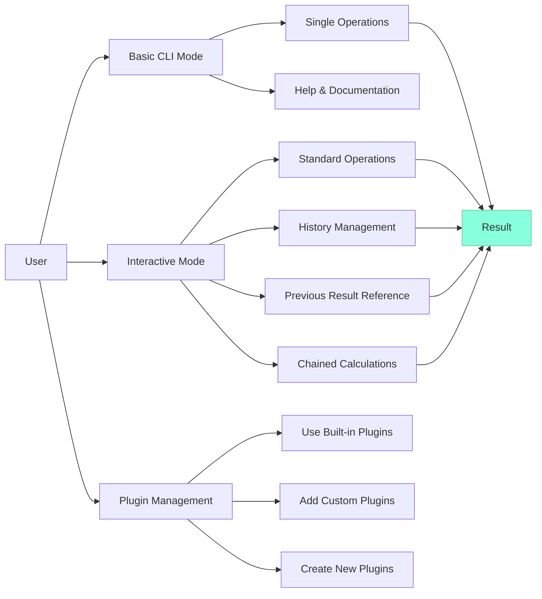

## 6. User Interaction Diagram

This diagram provides an overview of the different ways users can interact with the Math CLI application, showing the main features and how they lead to calculation results.

### User Interaction Paths

#### Basic CLI Mode
For simple, one-off calculations:
- **Single Operations**: Execute a single mathematical operation directly from the command line
- **Help & Documentation**: Access information about available operations and usage

#### Interactive Mode
For performing multiple calculations in succession:
- **Standard Operations**: Execute single operations one after another
- **History Management**: View, recall, and manage calculation history
- **Previous Result Reference**: Reference previous calculation results using `$` or `ans`
- **Chained Calculations**: Perform multiple operations in sequence with automatic result passing

#### Plugin Management
For extending the application's functionality:
- **Use Built-in Plugins**: Utilize the standard mathematical operations
- **Add Custom Plugins**: Add existing plugins from external sources
- **Create New Plugins**: Develop custom mathematical operations

All these interaction paths eventually lead to calculation results, which are the primary output of the application.
