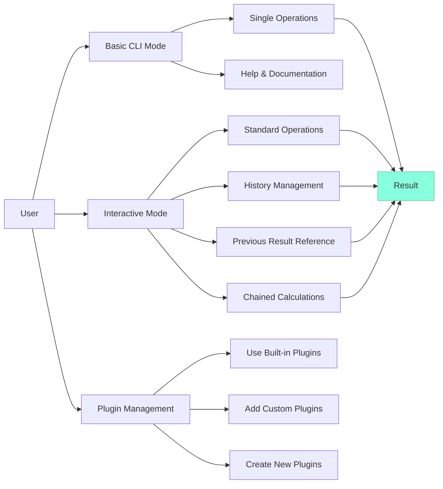

## 6. User Interaction Diagram

This diagram shows how users interact with the Math CLI application.

```mermaid
graph LR
    User --> A[Basic CLI Mode]
    User --> B[Interactive Mode]
    User --> C[Plugin Management]

    A --> A1[Single Operations]
    A --> A2[Help & Documentation]

    B --> B1[Standard Operations]
    B --> B2[History Management]
    B --> B3[Previous Result Reference]
    B --> B4[Chained Calculations]

    C --> C1[Use Built-in Plugins]
    C --> C2[Add Custom Plugins]
    C --> C3[Create New Plugins]

    B1 --> D[Result]
    B2 --> D
    B3 --> D
    B4 --> D
    A1 --> D

    style D fill:#8fd,stroke:#6c8
```
